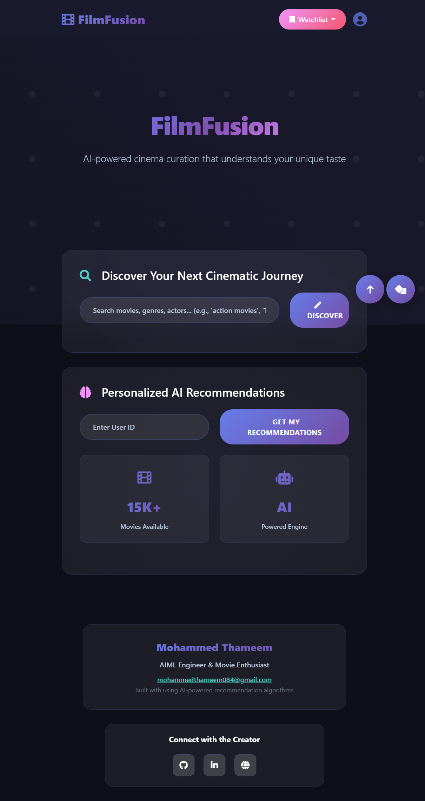

🎬 FilmFusion: An AI-Powered Hybrid Movie Recommender
FilmFusion is an AI-driven hybrid movie recommendation system that intelligently combines Collaborative Filtering and Content-Based Filtering to deliver personalized and context-aware movie suggestions. The entire engine is served via a high-performance FastAPI backend.

✨ UI Showcase
The simple and clean frontend allows users to easily search for movies and receive personalized recommendations from the AI engine.




Users can search for movies or enter their User ID to get recommendations.

The system generates a deep, scrollable list of curated movie suggestions.


🚀 Key Features
Hybrid Recommendation Engine: Dynamically blends content-based and collaborative filtering based on user rating history.

Advanced Collaborative Filtering: Utilizes Truncated SVD (Singular Value Decomposition) for powerful matrix factorization to uncover latent user preferences.

Robust Content-Based Filtering: Employs TF-IDF vectorization on movie metadata (genres, director, cast, overview) to find content-based similarities.

Effective Cold-Start Handling: Provides meaningful recommendations for new users by suggesting a list of popular and diverse movies to gather initial preferences.

High-Performance API: Built with FastAPI, providing a fast, modern, and auto-documenting RESTful API for all recommendation tasks.

End-to-End ML Pipeline: Includes a complete data preprocessing script (run_preprocessing.py) to clean, transform, and build all necessary models from raw data.

🏗️ Project Structure
```
FilmFusion-AI-Powered-Movie-Recommender/
├── data/
│   ├── raw/              # Raw dataset files (not in repo)
│   └── models/           # Trained ML models (.pkl, not in repo)
├── frontend/
│   ├── static/
│   │   └── app.js
│   └── templates/
│       └── index.html
├── screenshots/          # Contains UI images for the README
├── .gitignore
├── collaborative.py
├── content_based.py
├── hybrid_recommender.py
├── run_preprocessing.py
├── models.py
├── utils.py
├── config.py
├── main.py               # FastAPI application entry point
├── requirements.txt
└── README.md
```

🛠️ Installation & Setup
Clone the Repository

git clone [https://github.com/thammi21/FilmFusion-AI-Powered-Movie-Recommender.git](https://github.com/thammi21/FilmFusion-AI-Powered-Movie-Recommender.git)
cd FilmFusion-AI-Powered-Movie-Recommender

Create and Activate a Virtual Environment

# For Windows
python -m venv venv
.\venv\Scripts\activate

# For macOS/Linux
python3 -m venv venv
source venv/bin/activate

Install Dependencies

pip install -r requirements.txt

Download the Dataset
This project uses the MovieLens "Full" Dataset. Download it and place the following required CSV files into the data/raw/ directory:

movies_metadata.csv

ratings.csv

credits.csv

keywords.csv

Run the Preprocessing Pipeline
This is a one-time step that cleans the data and trains your production ML models.

python run_preprocessing.py

▶️ Run the Application
Start the API Server

uvicorn main:app --reload

Access the App
Open your browser and navigate to http://127.0.0.1:8000.

🧠 Tech Stack
Backend: Python, FastAPI, Uvicorn

Machine Learning: Scikit-learn, Pandas, NumPy

Environment: virtualenv

🧑‍💻 Author
Mohammed Thameem

GitHub Profile